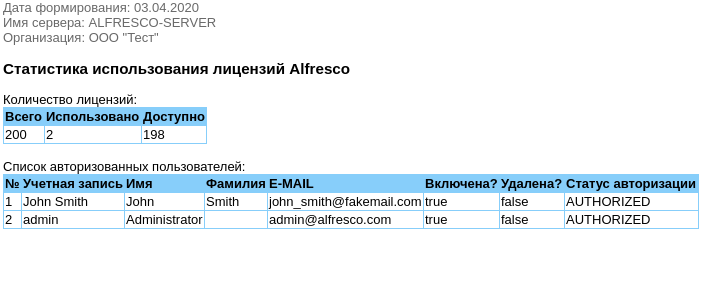

# Описание  
Скрипт формирует html-отчет со статиститикой по использованным лицензиям, а также авторизованным пользователям  `Alfresco Enterprise Edition` и отправляет на почту администратору.  
Протестировано в версии: **5.1.3.3.7.**      
В процессе выполнения скрипта:   
1) Формируется json-файл `people.json` с записями о текущих пользователях.  
Пример:
```
{
"people" : [
...
{
        "url": "\/alfresco\/s\/api\/people\/smith_john",
        "userName": "smith_john",
        "enabled": true,
        "firstName": "John",
        "lastName": "Smith",
        "jobtitle": null,
        "organization": null,
        "organizationId": null,
        "location": null,
        "telephone": null,
        "mobile": null,
        "email": "john_smith@fakemail.ru",
        "companyaddress1": null,
        "companyaddress2": null,
        "companyaddress3": null,
        "companypostcode": null,
        "companytelephone": null,
        "companyfax": null,
        "companyemail": null,
        "skype": null,
        "instantmsg": null,
        "userStatus": null,
        "userStatusTime": null,
        "googleusername": null,
        "quota": -1,
        "sizeCurrent": 0,
        "emailFeedDisabled": false,
        "persondescription": null,
        "authorizationStatus": "AUTHORIZED",
        "isDeleted": false,
        "isAdminAuthority": false
}
...
],
"paging":
 {
      "maxItems": 9,
      "totalItems": 9,
      "skipCount":0
 }
```   
2) В файл `people.csv` импортируются значения ключей json по каждому авторизованному пользователю:   
`userName`, `firstName`, `lastName`, `email`, `enabled`, `authorizationStatus`  

Пример:

```
1;smith_john;John;Smith;john_smith@fakemail.com;true;false;AUTHORIZED
2;admin;Administrator;;admin@alfresco.com;true;false;AUTHORIZED
```
3) Записи из файла `people.csv` импортируются в целевой отчет `report.html`, который отправляется пользователю на e-mail.  
Пример отчета:    


# Инструкция

1) Скопируйте файл `make-lic-report.sh` на целевой сервер Alfresco.  
2) Установите бит выполнения:
```bash
chmod +x parse.sh
```
3) Установите утилиту `jq` для парсинга данных json:
```bash
wget -O jq https://github.com/stedolan/jq/releases/download/jq-1.6/jq-linux64
chmod +x ./jq
cp jq /usr/bin
```
4) Измените в скрипте параметры отправки e-mail.   
Если она будет выполняться через SMTP-сервер gmail:
- перейдите в аккаунт google => безопасность: отключите 2-х факторную аутентификацию и разрешите ненадежным приложениям доступ к аккаунту.  
- в случае отсутствия сертфиката google cоздайте новый сертификат и БД ключей:
```bash
mkdir ~/.certs
certutil -N -d ~/.certs
```
Извлеките сертфикат с gmail и импортируйте cert-файл в новую БД:
```bash
echo -n | openssl s_client -connect smtp.gmail.com:465 | sed -ne '/-BEGIN CERTIFICATE-/,/-END CERTIFICATE-/p' > ~/.certs/gmail.crt
certutil -A -n "Google Internet Authority" -t "C,," -d ~/.certs -i ~/.certs/gmail.crt
```
Путь к сертификату указывается в переменной: `cert_dir`   

Если установлен браузер Mozilla Firefox, то сертификат можно найти по следующему пути: `~/.mozilla/firefox/*.default`.

5) Добавьте скрипт в планировщик заданий `crontab`.